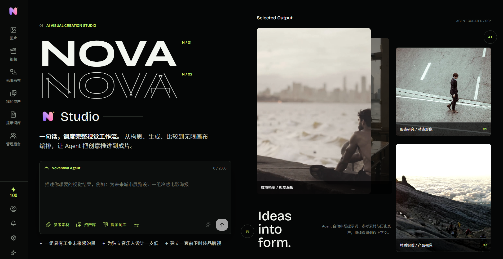
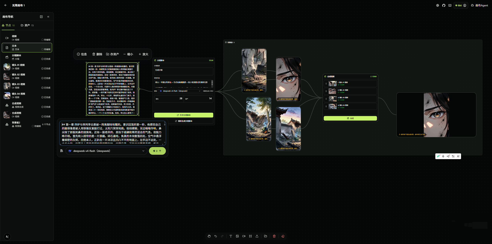
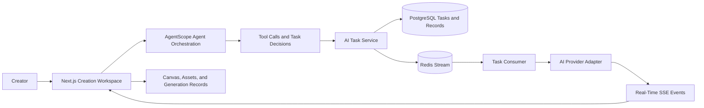

<p align="right"><a href="README.md">Simplified Chinese</a> · <b>English</b></p>

<p align="center">
  
</p>

<h1 align="center">Novanova Studio</h1>

<p align="center">
  An AI Agent-powered visual creation workspace where ideas, generation, editing, composition, and reusable results stay connected through persistent context.
</p>

<p align="center">
  <a href="https://www.novanovastudio.cn/">>>>> Try it online if deployment or finding affordable providers feels cumbersome <<<<</a>
</p>

<p align="center">
  
</p>
<p align="center">
  
</p>

## ✨ What It Is

Novanova Studio is an AI creation workspace for independent creators and visual teams. Rather than separating images, videos, prompts, and generation records across multiple tools, it uses an **infinite canvas** as the creative context and an **AI Agent** as the center for understanding intent, choosing tools, and advancing tasks.

Creators can start with a natural-language goal or reference materials, then continue to converse, generate, edit, compare, and reuse results across image, video, and canvas workflows. Generation records, assets, prompts, and canvas nodes remain connected in the same creative workflow.

## 🧠 An Agent Across the Creative Workflow

The Agent is not an isolated chat window or a one-off endpoint that forwards model requests. It spans the complete workflow, from intent understanding to preserving results:



| Stage | Agent and System Responsibilities | Creative Experience |
| --- | --- | --- |
| 1. Define an intent | Accept natural language, image references, or video references, then select the relevant Agent Profile (capability configuration) for the image, video, or canvas workflow. | Start with a description or existing material. |
| 2. Choose tools | Use the context to invoke image generation, image editing, video generation, video editing, history queries, or canvas operations. | Avoid repeatedly switching among feature pages. |
| 3. Create a task | Validate model capabilities and credits, save a task snapshot to PostgreSQL, and submit it to a Redis Stream consumer group. | Long-running generation does not block the current workflow. |
| 4. Execute and report | Task consumers call configured AI providers; task status, tool calls, and results are delivered to the frontend through SSE (Server-Sent Events). | View progress, failures, or cancellations in real time in conversations and on the canvas. |
| 5. Preserve context | Save generation results to generation records for continued use on the canvas and optional addition to the asset library. Canvas Agents can continue using node state and tool results. | Later edits and reuse retain the context from previous rounds of creation. |

### Agent Capabilities

| Workflow | Agent Capabilities | Result Destination |
| --- | --- | --- |
| Image creation | Invoke image generation, reference-image editing, and history-query tools in response to the conversation. | Conversation turns, generation records, and canvas image nodes; optionally added to the asset library. |
| Video creation | Invoke video generation, video editing, and history-query tools, while validating image or video references against model capabilities. | Conversation turns, generation records, and canvas video nodes; optionally added to the asset library. |
| Infinite canvas | Read the current canvas state; create, update, move, scale, delete, and connect nodes; create text, image, or video generation flows and start tasks. | Editable canvas projects and node relationships. |
| Prompt optimization | Apply independent strategies to optimize image and video prompts, then update the input only after optimization succeeds. | The current creation input; the original prompt is retained if optimization fails. |
| Live coordination | The frontend returns canvas tool results to the server-side Agent after each tool execution, allowing the Agent to continue based on actual results. | A continuous "conversation -> tool -> result -> continued conversation" experience. |

## 🎨 Core Features

- **Infinite canvas**: Compose text, images, videos, reference materials, and generation results in one space while retaining creative context.
- **Conversational image and video generation**: Generate, edit, reference historical results, and iterate further within one conversation.
- **Multi-provider model configuration**: Manage AI providers, model capabilities, default models, and credit consumption rules in Configuration & User Preferences.
- **Assets and generation records**: Save reusable assets, generation history, and prompts to reduce repeated uploads and configuration.
- **Object storage integration**: Supports Tencent Cloud COS, Alibaba Cloud OSS, and Qiniu Kodo for uploads and generated results.
- **User and operations features**: Email login, OAuth2 login, credits, notifications, a prompt library, home-page showcases, and an administrator console.
- **Asynchronous task processing**: Redis Stream consumer groups, task locks, failure recovery, and SSE event streams support traceable long-running tasks.

## 🤖 Supported Models and Providers

The project selects an adapter by a provider's `apiFormat` (API request format). Administrators synchronize and configure model names from providers, so there is no fixed, exhaustive model allowlist. Except for the dedicated models explicitly listed below, any model that implements the corresponding provider protocol and API can be added to the relevant image, video, or chat model catalog. Actual availability still depends on the models enabled for the provider account.

### Provider Capability Matrix

| Provider Format | Image Generation | Video Generation | Chat / Primary Agent | Default Base URL | Notes |
| --- | --- | --- | --- | --- | --- |
| OpenAI-compatible (`openai`) | ✅ | ✅ | ✅ | `https://api.openai.com/v1` | Supports OpenAI's official service and compatible providers that implement the same API protocol. |
| Gemini (`gemini`) | ✅ | ❌ | ✅ | `https://generativelanguage.googleapis.com/v1beta` | Uses Gemini's native `generateContent` API. |
| Agnes (`agnes`) | ✅ | ✅ | ⚠️ | Configured by the administrator | The text-task adapter supports Agnes Chat Completions, but the AgentScope model factory for the primary Agent does not yet support Agnes. |
| Anthropic (`anthropic`) | ❌ | ❌ | ✅ | `https://api.anthropic.com/v1` | Uses the Anthropic Messages API for Claude models. |
| Seedance (`seedance`) | ❌ | ✅ | ❌ | `https://ark.cn-beijing.volces.com/api/v3` | Uses the Volcano Engine Ark video-generation task API. |
| MiniMax (`minimax`) | ❌ | ✅ | ❌ | `https://api.minimaxi.com` | Uses the MiniMax H3 video-generation V2 API; the model must be configured manually. |

### Image Generation Models

| Provider | Currently Supported Model Scope | Implemented Capabilities |
| --- | --- | --- |
| OpenAI-compatible | Image models that provide the OpenAI Images API; no specific model names are required. | Text-to-image uses `/images/generations`; reference-image editing uses `/images/edits`. |
| Gemini | Models that return images through Gemini `generateContent`; no specific model names are required. | Text-to-image and reference-image generation; requests both `TEXT` and `IMAGE` response modalities. |
| Agnes | `agnes-image-2.1-flash` | Text-to-image, image-to-image, and multiple-reference-image generation. |

### Video Generation Models

| Provider | Currently Supported Model Scope | Implemented Capabilities |
| --- | --- | --- |
| OpenAI-compatible | Video models that provide an OpenAI-compatible Videos API; no specific model names are required. | Text-to-video and up to seven reference images; video references are not supported. |
| Agnes | `agnes-video-v2.0` | Text-to-video with single-image or multiple-image references; video references are not supported. |
| Seedance | Doubao Seedance 2.0 series, Doubao Seedance 1.5 Pro, Doubao Seedance 1.0 Pro, Doubao Seedance 1.0 Pro Fast, and model IDs or inference endpoint IDs compatible with the same task API. | Text-to-video and reference-image generation; the Seedance 2.0 series supports up to nine reference images and three reference videos. |
| MiniMax | `MiniMax-H3` | Text-to-video with image or video references; supports up to nine reference images and three reference videos, `768P` or `2K` resolution, and 4-15 second durations. |

### Chat Models

| Provider | Currently Supported Model Scope | API and Use |
| --- | --- | --- |
| OpenAI-compatible | GPT-series models and other models that implement the OpenAI Chat Completions protocol; no specific model names are required. | `/chat/completions`, with streaming output and Agent tool invocation. |
| Gemini | Gemini text or multimodal chat models; no specific model names are required. | Gemini's native API for primary-Agent conversations and task planning. |
| Anthropic | Claude-series models; no specific model names are required. | `/v1/messages`, with streaming output and Agent tool invocation. |

> ⚠️ A model being available from a provider does not mean it has the corresponding generation capability. Administrators must still mark each model as text, image, or video, configure its specific capabilities, and set default models for each type.

## ⚙️ Technical Architecture

| Layer | Main Technologies | Purpose |
| --- | --- | --- |
| Web | Next.js 16, React 19, TypeScript, Ant Design 6, Tailwind CSS, Zustand, React Flow | Creation workspace, conversations, canvas, and configuration interface. |
| Server | Java 21, Spring Boot 3.5, Spring WebFlux, AgentScope Java, Fastjson2 | Reactive APIs, Agent orchestration, task scheduling, authentication, and business services. |
| Data and tasks | PostgreSQL 17, Flyway, R2DBC (reactive database connectivity), Redis 8.6, Redis Stream | Persistence for users, projects, tasks, assets, and generation records; asynchronous task delivery and recovery. |
| AI and storage | OpenAI-, Gemini-, Agnes-, Anthropic-, Seedance-, and MiniMax-format providers; COS, OSS, Kodo | Connect models and object storage through the administrator console instead of exposing credentials in the browser. |
| Deployment | Docker Compose, Nginx, Node.js 22, Maven | Local dependencies, containerized builds, and Linux server deployment. |

## 📁 Repository Layout

```text
.
├── web/                         # Next.js frontend and creation workspace
├── server/                      # Spring Boot, Agent, and task services
│   ├── config/prompts/          # Image, video, canvas Agent, and prompt-optimization templates
│   └── src/main/resources/      # Application configuration and Flyway database migrations
├── docker-compose.yml           # PostgreSQL, Redis, frontend, backend, and Nginx orchestration
├── .env.example                 # Example local and deployment environment variables
├── docs/                        # Database design, canvas design, and other project documentation
└── logo/                        # Project brand assets
```

## 🚀 Run Locally or Deploy

### Local Development

- [Guide to Running and Debugging from Source](deploy_docs/local-source-development.md)

### Server Deployment

- [Complete Docker Deployment Guide](deploy_docs/docker-deploy.md)

## 📝 Agent Prompt Configuration

Agent behavioral prompts are stored as editable files in `server/config/prompts/`; they do not need to be hardcoded in Java:

| File | Purpose | Override Environment Variable |
| --- | --- | --- |
| `agent-main.md` | Primary Agent intent recognition, task dependency graph, and page capability boundaries. | `AI_SYSTEM_PROMPT_AGENT_MAIN_FILE` |
| `agent-image.md` | Tools and behavioral constraints for the image-generation and image-editing Agent. | `AI_SYSTEM_PROMPT_AGENT_IMAGE_FILE` |
| `agent-video.md` | Tools and behavioral constraints for the video-generation and video-editing Agent. | `AI_SYSTEM_PROMPT_AGENT_VIDEO_FILE` |
| `agent-canvas.md` | Canvas-state understanding and canvas-operation constraints for the canvas Agent. | `AI_SYSTEM_PROMPT_AGENT_CANVAS_FILE` |
| `agent-storyboard.md` | Storyboard generation and Chinese prompt-composition constraints. | `AI_SYSTEM_PROMPT_AGENT_STORYBOARD_FILE` |
| `optimization-image.md` | Image prompt optimization strategy. | `AI_SYSTEM_PROMPT_OPTIMIZATION_IMAGE_FILE` |
| `optimization-video.md` | Video prompt optimization strategy. | `AI_SYSTEM_PROMPT_OPTIMIZATION_VIDEO_FILE` |

By default, local development reads from `server/config/prompts/` at the project root. For Docker deployments, Compose mounts that directory read-only at `/app/config/prompts/`. When replacing a prompt-file path, make sure the runtime directory and corresponding environment variable match.

## 🔒 Security Notes

Do not commit `.env`, AI provider credentials, object storage credentials, or certificate private keys to Git. Browser-visible `NEXT_PUBLIC_*` environment variables must never contain secrets.

## 🔍 Troubleshooting

| Symptom | What to Check |
| --- | --- |
| `http://127.0.0.1:8080/api/v1/health` is unavailable | Confirm PostgreSQL and Redis are running, the connection address and port in `.env` are correct, and inspect the server startup logs. |
| The frontend cannot call the API | Confirm the server uses port `8080`. If you changed it, set `NEXT_PUBLIC_SERVER_URL` before starting `pnpm dev`. |
| No models are available on the Agent or generation pages | Save the AI provider, model capability configuration, and corresponding default models in Configuration & User Preferences. |
| Uploading materials or saving generated results fails | Check that default object storage is configured, its credentials are valid, and the bucket has read and write permissions. |
| Agent prompt files cannot be found | Start from the project root with `mvn -f server/pom.xml spring-boot:run`, or explicitly override the relevant `AI_SYSTEM_PROMPT_*_FILE` environment variable. |
| Nginx fails in a full Docker Compose deployment | Nginx uses `network_mode: host` and host-directory mounts, which are suitable only for Linux servers. See the [Docker Deployment Guide](deploy_docs/docker-deploy.md). |

## 📚 Related Documentation

- [Product Overview](PRODUCT.md)
- [Open Source License](LICENSE)

## External Links

- [Linux Do Open Source Community](https://linux.do/)
- [AgentScope Java](https://java.agentscope.io/v2/en/intro.html)

## Contact

mail: zhenglin.cn.cq@gmail.com