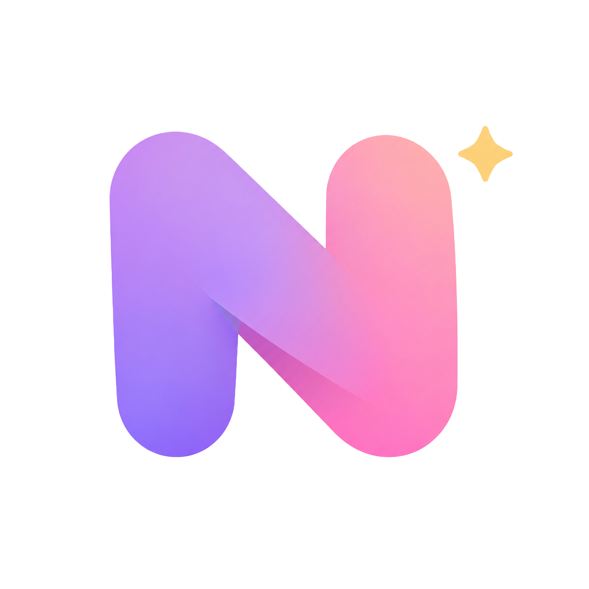
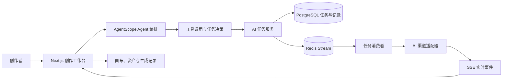

<p align="center">
  
</p>

<h1 align="center">Novanova Studio</h1>

<p align="center">
  AI Agent 驱动的视觉创作工作台：在一个持续保留上下文的空间里完成构思、生成、编辑、编排与沉淀。
</p>

## ✨ 项目定位

Novanova Studio 是面向独立创作者与视觉团队的 AI 创作工作台。它不是把图片、视频、提示词和生成记录拆散在多个工具中的集合，而是以**无限画布**作为创作上下文，以 **AI Agent** 作为理解意图、选择工具和推进任务的中枢。

创作者可以从一句自然语言目标或一组参考素材开始，在图片、视频和画布场景中持续对话、生成、编辑、比较与复用结果；生成记录、资产、提示词和画布节点会保留在同一条创作链路中。

## 🧠 Agent 贯穿创作链路

Agent 不是单独的聊天窗口，也不是一次性转发模型请求的接口。它贯穿从意图理解到结果沉淀的完整流程：



| 阶段 | Agent 与系统职责 | 创作体验 |
| --- | --- | --- |
| 1. 输入目标 | 接收自然语言、图片或视频参考素材，按图片、视频或画布场景选择对应 Agent Profile（能力配置）。 | 从一句描述或已有素材开始。 |
| 2. 选择工具 | 根据上下文调用图片生成、图片编辑、视频生成、视频编辑、历史查询或画布操作工具。 | 不必在多个功能页之间反复切换。 |
| 3. 创建任务 | 校验模型能力与积分，写入 PostgreSQL 任务快照，并投递到 Redis Stream（Redis 的持久消息流）消费组。 | 长耗时生成不会阻塞当前创作。 |
| 4. 执行与反馈 | 任务消费者调用已配置的 AI 渠道；状态、工具调用和结果通过 SSE（Server-Sent Events，服务端推送事件流）推送回前端。 | 在对话和画布中看到实时进度、失败或取消状态。 |
| 5. 沉淀上下文 | 生成结果写入生成记录，可在画布中继续引用，并按需加入资产库；画布 Agent 可继续引用节点状态与工具结果。 | 下一轮修改和复用保留前一轮创作上下文。 |

### Agent 能力

| 场景 | Agent 能力 | 结果去向 |
| --- | --- | --- |
| 图片创作 | 根据对话调用图片生成、参考图编辑与历史查询工具。 | 对话轮次、生成记录与画布图片节点；可按需加入资产库。 |
| 视频创作 | 调用视频生成、视频编辑与历史查询工具，并按模型能力校验图片或视频参考。 | 对话轮次、生成记录与画布视频节点；可按需加入资产库。 |
| 无限画布 | 读取当前画布状态，创建、更新、移动、缩放、删除和连接节点；可创建文本、图片、视频生成流并启动任务。 | 可继续编辑的画布项目与节点关系。 |
| 提示词优化 | 图片和视频使用独立策略优化提示词，优化成功后再回填输入内容。 | 当前创作输入，不覆盖失败前的原始提示词。 |
| 实时协作 | 前端画布工具执行后把工具结果回传给服务端 Agent，Agent 可基于真实执行结果继续下一轮。 | 保持“对话 -> 工具 -> 结果 -> 继续对话”的连续体验。 |

## 🎨 核心功能

- **无限画布**：把文字、图片、视频、参考素材和生成结果放到同一空间编排，保留创作上下文。
- **对话式图片与视频生成**：在同一会话中完成生成、编辑、引用历史结果和继续迭代。
- **多渠道模型配置**：在“配置与用户偏好”中维护 AI 渠道、模型能力、默认模型和积分消耗规则。
- **素材与生成记录**：保存可复用资产、生成历史和提示词，减少重复上传与重复配置。
- **对象存储接入**：支持腾讯云 COS、阿里云 OSS、七牛云 Kodo，用于上传素材与保存生成结果。
- **用户与运营能力**：邮箱登录、OAuth2 登录、积分、通知、提示词库、首页展示和管理员后台。
- **异步任务机制**：Redis Stream 消费组、任务锁、失败恢复与 SSE 事件流支撑可追踪的长耗时任务。

## ⚙️ 技术架构

| 层级 | 主要技术 | 作用 |
| --- | --- | --- |
| Web | Next.js 16、React 19、TypeScript、Ant Design 6、Tailwind CSS、Zustand、React Flow | 创作工作台、对话、画布与配置界面。 |
| 服务端 | Java 21、Spring Boot 3.5、Spring WebFlux、AgentScope Java、Fastjson2 | 响应式 API、Agent 编排、任务调度、鉴权与业务服务。 |
| 数据与任务 | PostgreSQL 17、Flyway、R2DBC（响应式数据库连接）、Redis 8.6、Redis Stream | 用户、项目、任务、资产和生成记录持久化；异步任务分发与恢复。 |
| AI 与存储 | OpenAI、Gemini、Agnes、Anthropic 格式渠道；COS、OSS、Kodo | 通过后台配置接入模型渠道和对象存储，而非把密钥放入浏览器。 |
| 部署 | Docker Compose、Nginx、Node.js 22、Maven | 本地依赖服务、容器化构建与 Linux 服务器部署。 |

## 📁 目录说明

```text
.
├── web/                         # Next.js 前端与创作工作台
├── server/                      # Spring Boot、Agent 与任务服务
│   ├── config/prompts/          # 图片、视频、画布 Agent 与提示词优化模板
│   └── src/main/resources/      # 应用配置与 Flyway 数据库迁移
├── docker-compose.yml           # PostgreSQL、Redis、前后端与 Nginx 编排
├── .env.example                 # 本地与部署环境变量样例
├── docs/                        # 数据库设计、画布设计与其他项目文档
└── logo/                        # 项目品牌资源
```

## 🚀 本地启动

以下步骤以 **Windows PowerShell** 为例。推荐的本地开发方式是：Docker 只运行 PostgreSQL 和 Redis，Java 服务端与 Next.js 前端分别在本机启动。这样既保留热更新，也避免 Nginx 的 Linux 宿主机依赖。

### 1. 准备环境

| 组件 | 要求 | 用途 |
| --- | --- | --- |
| Git | 当前稳定版本 | 获取源码。 |
| Docker Desktop 与 Docker Compose | 使用 Linux 容器 | 启动 PostgreSQL 17 与 Redis 8.6。 |
| JDK | 21 | 运行 Spring Boot 服务端。 |
| Maven | 3.9 或更高版本 | 启动服务端。 |
| Node.js | 22 | 运行 Next.js 前端。 |
| Corepack / pnpm | pnpm 11.7.0 | 安装与运行前端依赖。 |

进入项目根目录；首次获取源码时，将占位地址替换为实际仓库地址：

```powershell
git clone <仓库地址> novanova-studio
Set-Location novanova-studio
```

### 2. 创建本地环境变量

`.env` 已被 Git 忽略。首次使用时从样例创建，已有 `.env` 时不会被覆盖：

```powershell
if (!(Test-Path -LiteralPath .env)) {
    Copy-Item -LiteralPath .env.example -Destination .env
}
```

为 `APP_SECRET_KEY` 生成随机值并写入 `.env`。该密钥用于签发 Bearer Token，任何环境都不能留空：

```powershell
$secretBytes = [byte[]]::new(48)
$randomGenerator = [System.Security.Cryptography.RandomNumberGenerator]::Create()
$randomGenerator.GetBytes($secretBytes)
$randomGenerator.Dispose()
[Convert]::ToBase64String($secretBytes)
```

至少检查并按你的本机环境修改以下项：

| 配置项 | 本地默认值 | 说明 |
| --- | --- | --- |
| `APP_SECRET_KEY` | 无 | 必填，使用上一步生成的随机值。 |
| `SERVER_PORT` | `8080` | 服务端端口；前端默认代理到此端口。 |
| `POSTGRES_HOST` / `POSTGRES_PORT` | `127.0.0.1` / `5432` | PostgreSQL 连接地址。 |
| `REDIS_HOST` / `REDIS_PORT` | `127.0.0.1` / `6379` | Redis 连接地址。 |
| `ADMIN_INITIAL_EMAIL` / `ADMIN_INITIAL_PASSWORD` | `admin@admin.com` / `novanovastudio@pwss` | 仅在同邮箱账号不存在时创建初始管理员；本地可用，部署前必须修改。 |
| `CORS_ALLOWED_ORIGIN_PATTERNS` | 样例值 | 仅在浏览器绕过 Next.js 代理直接请求后端时，补充实际前端来源。 |

### 3. 启动 PostgreSQL 与 Redis

在项目根目录执行：

```powershell
docker compose up -d postgres redis
docker compose ps postgres redis
```

两个服务状态正常后，数据会保存在项目根目录的 `volume/` 下。停止本地依赖服务时使用以下命令，数据不会被删除：

```powershell
docker compose stop postgres redis
```

### 4. 启动服务端

保持命令在**项目根目录**执行。这样本地默认的 Agent 提示词路径 `server/config/prompts/` 与根目录 `.env` 都能按当前配置被读取：

```powershell
$env:JAVA_HOME = "$env:USERPROFILE\.jabba\jdk\openjdk@21.0.2"
$env:PATH = "$env:JAVA_HOME\bin;$env:PATH"
java -version
mvn -f server/pom.xml spring-boot:run
```

如果 JDK 21 已经在系统 `PATH` 中，可省略前两行。服务启动后可在新的 PowerShell 窗口验证：

```powershell
Invoke-RestMethod http://127.0.0.1:8080/api/v1/health
```

默认 API 文档地址为 [http://127.0.0.1:8080/swagger/index.html](http://127.0.0.1:8080/swagger/index.html)。

### 5. 启动前端

打开第二个 PowerShell 窗口，从项目根目录执行：

```powershell
Set-Location web
corepack enable
pnpm install --frozen-lockfile
pnpm dev
```

前端默认运行在 [http://127.0.0.1:5555](http://127.0.0.1:5555)，开发模式会将 `/api/v1/*` 转发到 `http://127.0.0.1:8080`。

若你在 `.env` 中修改了 `SERVER_PORT`，请在启动前端前显式设置后端地址：

```powershell
$env:NEXT_PUBLIC_SERVER_URL = "http://127.0.0.1:<服务端端口>"
pnpm dev
```

### 6. 完成首次配置

1. 访问 [http://127.0.0.1:5555](http://127.0.0.1:5555)，使用 `.env` 中的初始管理员账号登录。
2. 打开 **配置与用户偏好**，在“我的渠道”中添加 AI 渠道并填写服务端 API 地址、密钥和可用模型。
3. 在“我的模型”中配置文本、图像、视频模型的能力与默认项；未配置可用默认模型时，Agent 与生成任务无法选择模型。
4. 需要上传素材或持久化生成媒体时，在“对象存储”中配置并设为默认对象存储。
5. 进入图片、视频或画布页面，开始对话式创作；管理员可在“系统管理”中维护用户、积分、公告和提示词库。

## 📝 Agent 提示词配置

Agent 行为提示词以可编辑文件保存在 `server/config/prompts/`，不需要把提示词硬编码到 Java 代码中：

| 文件 | 用途 | 可覆盖环境变量 |
| --- | --- | --- |
| `agent-image.md` | 图片生成与编辑 Agent 的工具与行为约束。 | `AI_SYSTEM_PROMPT_AGENT_IMAGE_FILE` |
| `agent-video.md` | 视频生成与编辑 Agent 的工具与行为约束。 | `AI_SYSTEM_PROMPT_AGENT_VIDEO_FILE` |
| `agent-canvas.md` | 画布 Agent 的状态理解与画布操作约束。 | `AI_SYSTEM_PROMPT_AGENT_CANVAS_FILE` |
| `optimization-image.md` | 图片提示词优化策略。 | `AI_SYSTEM_PROMPT_OPTIMIZATION_IMAGE_FILE` |
| `optimization-video.md` | 视频提示词优化策略。 | `AI_SYSTEM_PROMPT_OPTIMIZATION_VIDEO_FILE` |

本地默认从项目根目录下的 `server/config/prompts/` 读取；Docker 部署时，Compose 会将该目录只读挂载到 `/app/config/prompts/`。替换提示词文件路径时，请同时确认运行目录与对应环境变量一致。

## 🐳 Docker 部署边界

根目录 `docker-compose.yml` 同时定义了完整的 `web`、`server` 和 `nginx` 服务，但其中的 Nginx 使用 `network_mode: host`，并挂载 Linux 宿主机的 `/etc`、日志、静态资源和证书目录。因此：

- **本地开发**：按上文仅启动 `postgres` 与 `redis`，再分别启动服务端和前端。
- **完整容器部署**：仅适用于已准备好 Nginx 配置、静态资源、日志和证书目录的 Linux 主机。设置好 `.env` 及对应 `NGINX_*` 路径后再执行：

```bash
docker compose up --build -d
docker compose ps
```

不要把 `.env`、AI 渠道密钥、对象存储密钥或证书私钥提交到 Git。浏览器可见的 `NEXT_PUBLIC_*` 环境变量不应用于保存任何密钥。

## 🔍 常见问题

| 现象 | 检查方向 |
| --- | --- |
| `http://127.0.0.1:8080/api/v1/health` 无法访问 | 确认 PostgreSQL、Redis 已启动，`.env` 中连接地址与端口正确，并查看服务端启动日志。 |
| 前端页面无法请求 API | 确认服务端端口为 `8080`；若改过端口，在启动 `pnpm dev` 前设置 `NEXT_PUBLIC_SERVER_URL`。 |
| Agent 或生成页没有可选模型 | 在“配置与用户偏好”中保存 AI 渠道、模型能力和对应默认模型。 |
| 上传素材或保存生成结果失败 | 检查默认对象存储是否已配置、凭证是否有效，以及存储桶的读写权限。 |
| 找不到 Agent 提示词文件 | 从项目根目录使用 `mvn -f server/pom.xml spring-boot:run` 启动，或显式覆盖对应 `AI_SYSTEM_PROMPT_*_FILE` 环境变量。 |
| Windows 上完整 Compose 启动 Nginx 异常 | 使用推荐的本地开发路径；完整 Nginx 编排依赖 Linux 宿主机网络和目录挂载。 |

## 📚 相关文档

- [数据库设计](docs/backend-database.md)
- [用户系统设计](docs/user-system-design.md)
- [产品定位](PRODUCT.md)
- [开源许可证](LICENSE)
