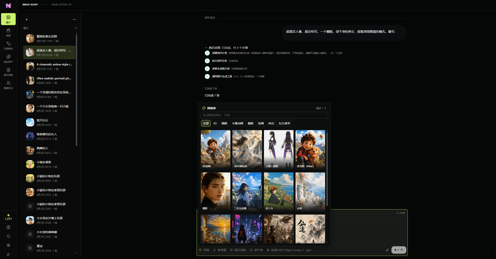
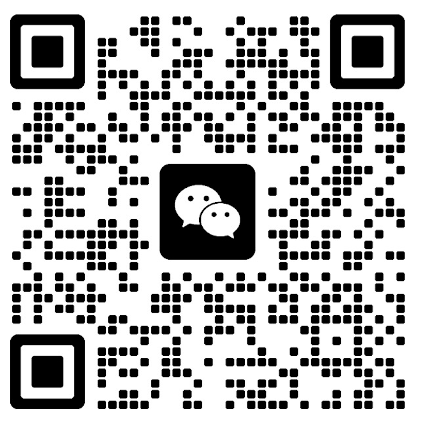
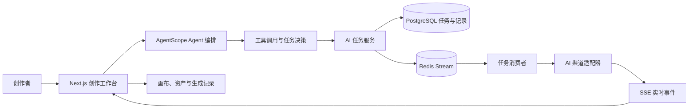

<p align="right"><b>简体中文</b> · <a href="README.en.md">English</a></p>

<p align="center">
  
</p>

<h1 align="center">Novanova Studio</h1>

<p align="center">
  AI Agent 驱动的视觉创作工作台：在一个持续保留上下文的空间里完成构思、生成、编辑、编排与沉淀。
</p>

<p align="center">
  <a href="https://www.novanovastudio.cn/">>>>>如果觉得部署麻烦、找便宜渠道麻烦->点我在线体验<<<<<</a>
</p>

<p align="center">
  
</p>
<p align="center">
  
</p>
<p align="center">
  
</p>

## 联系我
- 商业授权
- 技术支持

<table align="center">
  <thead>
    <tr>
      <th align="center">联系作者</th>
      <th align="center">加入交流群</th>
    </tr>
  </thead>
  <tbody>
    <tr>
      <td align="center" width="33%">
        
      </td>
      <td align="center" width="33%">
        
      </td>
    </tr>
  </tbody>
</table>

## ✨ 项目定位

Novanova Studio 是面向独立创作者与视觉团队的 AI 创作工作台。它不是把图片、视频、提示词和生成记录拆散在多个工具中的集合，而是以**无限画布**作为创作上下文，以 **AI Agent** 作为理解意图、选择工具和推进任务的中枢。

创作者可以从一句自然语言目标或一组参考素材开始，在图片、视频和画布场景中持续对话、生成、编辑、比较与复用结果；生成记录、资产、提示词和画布节点会保留在同一条创作链路中。

## 🧠 Agent 贯穿创作链路

Agent 不是单独的聊天窗口，也不是一次性转发模型请求的接口。它贯穿从意图理解到结果沉淀的完整流程：



| 阶段 | Agent 与系统职责 | 创作体验 |
| --- | --- | --- |
| 1. 输入目标 | 接收自然语言、图片或视频参考素材，按图片、视频或画布场景选择对应 Agent Profile（能力配置）。 | 从一句描述或已有素材开始。 |
| 2. 选择工具 | 根据上下文调用图片生成、图片编辑、视频生成、视频编辑、历史查询或画布操作工具。 | 不必在多个功能页之间反复切换。 |
| 3. 创建任务 | 校验模型能力与积分，写入 PostgreSQL 任务快照，并投递到 Redis Stream（Redis 的持久消息流）消费组。 | 长耗时生成不会阻塞当前创作。 |
| 4. 执行与反馈 | 任务消费者调用已配置的 AI 渠道；状态、工具调用和结果通过 SSE（Server-Sent Events，服务端推送事件流）推送回前端。 | 在对话和画布中看到实时进度、失败或取消状态。 |
| 5. 沉淀上下文 | 生成结果写入生成记录，可在画布中继续引用，并按需加入资产库；画布 Agent 可继续引用节点状态与工具结果。 | 下一轮修改和复用保留前一轮创作上下文。 |

### Agent 能力

| 场景 | Agent 能力 | 结果去向 |
| --- | --- | --- |
| 图片创作 | 根据对话调用图片生成、参考图编辑与历史查询工具。 | 对话轮次、生成记录与画布图片节点；可按需加入资产库。 |
| 视频创作 | 调用视频生成、视频编辑与历史查询工具，并按模型能力校验图片或视频参考。 | 对话轮次、生成记录与画布视频节点；可按需加入资产库。 |
| 无限画布 | 读取当前画布状态，创建、更新、移动、缩放、删除和连接节点；可创建文本、图片、视频生成流并启动任务。 | 可继续编辑的画布项目与节点关系。 |
| 提示词优化 | 图片和视频使用独立策略优化提示词，优化成功后再回填输入内容。 | 当前创作输入，不覆盖失败前的原始提示词。 |
| 实时协作 | 前端画布工具执行后把工具结果回传给服务端 Agent，Agent 可基于真实执行结果继续下一轮。 | 保持“对话 -> 工具 -> 结果 -> 继续对话”的连续体验。 |

## 🎨 核心功能

- **无限画布**：把文字、图片、视频、参考素材和生成结果放到同一空间编排，保留创作上下文。
- **对话式图片与视频生成**：在同一会话中完成生成、编辑、引用历史结果和继续迭代。
- **多渠道模型配置**：在“配置与用户偏好”中维护 AI 渠道、模型能力、默认模型和积分消耗规则。
- **素材与生成记录**：保存可复用资产、生成历史和提示词，减少重复上传与重复配置。
- **对象存储接入**：支持腾讯云 COS、阿里云 OSS、七牛云 Kodo，用于上传素材与保存生成结果。
- **用户与运营能力**：邮箱登录、OAuth2 登录、积分、通知、提示词库、首页展示和管理员后台。
- **异步任务机制**：Redis Stream 消费组、任务锁、失败恢复与 SSE 事件流支撑可追踪的长耗时任务。

### 🚀 当前分支新增能力

- **视频生成技能与工作流**：管理员可维护图片、视频生成技能；视频页支持技能引导式多轮澄清、提示词草案确认，以及首帧、尾帧图片生成后再合成视频。
- **首尾帧视频模式**：新增 `first-last-frame-to-video` 能力，支持将首帧和尾帧作为带角色的参考素材传入兼容渠道。
- **自定义模型调用**：图片和视频模型可配置自有 API 的请求/响应模板、异步查询路径和占位符，适配自建模型服务。
- **模型展示配置**：管理员可为模型设置展示名称和展示图标；Evolink 渠道支持拉取模型列表。
- **视频分档计费**：可按视频模型的分辨率、时长等规格配置积分价格，工作流会展示各阶段报价。
- **积分流水与快捷入口**：用户可从画布顶部查看积分余额并进入积分记录，流水支持增加、消耗和退款方向及来源筛选。
- **管理与可观测性**：新增技能管理、风格封面分类、提示词封面、结果详情和接口访问日志；AI 异步任务轮询间隔支持统一配置。

## 🌟 项目优势特点

### 🧠 Agent 驱动的连续创作上下文

Agent 不只是一次性调用模型，而是贯穿需求理解、工具选择、任务编排、结果反馈和下一轮创作。对话、生成记录、素材与画布节点可以持续互相引用，减少在多个工具之间重复整理上下文。

### 🎨 无限画布连接创作过程

文字、参考素材、图片、视频、生成任务和结果都可以放在同一张画布中进行编排。画布 Agent 能读取节点状态并执行创建、移动、缩放、连接和生成等操作，让画布成为可继续编辑的创作项目，而不只是结果展示页。

### 🧩 技能化、工作流化的复杂创作

技能通过可配置提示词驱动引导式交互，工作流负责定义阶段、任务角色和状态流转。例如首尾帧视频工作流可以依次完成需求澄清、提示词确认、首帧生成、尾帧生成和视频合成，后续可以沿用同一机制扩展更多创作流程。

### 🔌 开放的模型与渠道接入

项目采用渠道适配器和模型能力配置解耦的方式，支持 OpenAI 兼容、Gemini、Agnes、Seedance、MiniMax、Evolink 等渠道，也支持通过请求/响应模板接入自有图片或视频模型。模型展示名称、图标、能力和计费规则可以由管理员独立配置。

### ⚡ 面向长耗时任务的可靠执行

图片和视频生成通过 Redis Stream 异步队列执行，结合任务锁、状态轮询、SSE 实时事件、取消、失败恢复和统一轮询配置，适合处理视频生成等长耗时任务，并保持任务状态可追踪。

### 🔒 可私有化部署、可运营扩展

服务端集中管理模型密钥和对象存储凭证，支持 Docker Compose、PostgreSQL、Redis 及多种对象存储部署方式。管理后台覆盖模型、技能、风格、提示词封面、结果详情、积分流水和接口访问日志，便于按团队或业务场景运营。

## 🤖 支持的模型与渠道

项目通过渠道的 `apiFormat`（接口调用格式）选择对应适配器，模型名称由管理员从渠道同步后配置，不维护固定的全量模型白名单。因此，除下表明确写出的专用模型外，只要模型实现对应渠道协议和接口，就可以加入相应的图片、视频或 Chat 模型目录；最终可用范围仍取决于渠道账号实际开通的模型。

### 渠道能力矩阵

| 渠道格式 | 生成图片 | 生成视频 | Chat / 主 Agent | 默认 Base URL | 说明 |
| --- | --- | --- | --- | --- | --- |
| OpenAI 兼容（`openai`） | ✅ | ✅ | ✅ | `https://api.openai.com/v1` | 支持 OpenAI 官方服务及实现相同接口协议的兼容渠道。 |
| Evolink（`evolink`） | ❌ | ✅ | ❌ | `https://api.evolink.ai/v1` | 使用 Evolink 自有异步视频生成接口，支持从渠道拉取模型列表。 |
| Gemini（`gemini`） | ✅ | ❌ | ✅ | `https://generativelanguage.googleapis.com/v1beta` | 使用 Gemini 原生 `generateContent` 接口。 |
| Agnes（`agnes`） | ✅ | ✅ | ⚠️ | 由管理员填写 | 文本任务适配器支持 Agnes Chat Completions，但当前主 Agent 的 AgentScope 模型工厂未接入 Agnes。 |
| Anthropic（`anthropic`） | ❌ | ❌ | ✅ | `https://api.anthropic.com/v1` | 使用 Anthropic Messages 接口，适用于 Claude 模型。 |
| Seedance（`seedance`） | ❌ | ✅ | ❌ | `https://ark.cn-beijing.volces.com/api/v3` | 使用火山方舟视频生成任务接口。 |
| MiniMax（`minimax`） | ❌ | ✅ | ❌ | `https://api.minimaxi.com` | 使用 MiniMax H3 视频生成 V2 接口，模型需手动配置。 |
| 自定义（`custom`） | ✅ | ✅ | ❌ | 由管理员填写 | 按模型配置的请求/响应模板调用自有图片或视频 API；视频支持异步轮询，模型列表需手动配置。 |

### 生成图片模型

| 渠道 | 当前支持的模型范围 | 已实现能力 |
| --- | --- | --- |
| OpenAI 兼容 | 提供 OpenAI Images API 的图片模型，不限制具体模型名称。 | 文生图调用 `/images/generations`；带参考图时调用 `/images/edits`。 |
| Gemini | 支持通过 Gemini `generateContent` 返回图片的模型，不限制具体模型名称。 | 文生图、参考图生成；请求 `TEXT` 和 `IMAGE` 两种响应模态。 |
| Agnes | `agnes-image-2.1-flash` | 文生图、图生图和多参考图生成。 |

### 生成视频模型

| 渠道 | 当前支持的模型范围 | 已实现能力 |
| --- | --- | --- |
| OpenAI 兼容 | 提供 OpenAI 兼容 Videos API 的视频模型，不限制具体模型名称。 | 文生视频、最多 7 张参考图生成；不支持参考视频。 |
| Agnes | `agnes-video-v2.0` | 文生视频、单图或多图参考生成；不支持参考视频。 |
| Seedance | Doubao Seedance 2.0 系列、Doubao Seedance 1.5 Pro、Doubao Seedance 1.0 Pro、Doubao Seedance 1.0 Pro Fast，以及兼容同一任务接口的模型 ID 或推理接入点 ID。 | 文生视频、参考图生成；Seedance 2.0 系列支持最多 9 张参考图和 3 个参考视频。 |
| MiniMax | `MiniMax-H3` | 文生视频、图片或视频参考生成；支持最多 9 张参考图和 3 个参考视频，分辨率为 `768P` 或 `2K`，时长为 4～15 秒。 |
| Evolink | Evolink 文档中开通的 Seedance 2.0 模型 | 文生视频、图片或视频参考生成；通过 Evolink 自有 `/v1/videos/generations` 异步接口创建任务，并通过 `/v1/tasks/{task_id}` 查询结果。 |
| 自定义 | 管理员配置的模型 | 按模型模板调用自有视频 API，支持文生视频、参考素材和异步任务轮询；具体能力取决于配置。 |

首尾帧技能工作流默认包含“生成首帧”“生成尾帧”“合成视频”三个阶段。只有各阶段模型能力和积分价格均配置完成后，工作流才会显示可用报价。

### Chat 模型

| 渠道 | 当前支持的模型范围 | 接口与用途 |
| --- | --- | --- |
| OpenAI 兼容 | GPT 系列及其他实现 OpenAI Chat Completions 协议的模型，不限制具体模型名称。 | `/chat/completions`，支持流式输出和 Agent 工具调用。 |
| Gemini | Gemini 文本或多模态 Chat 模型，不限制具体模型名称。 | Gemini 原生接口，用于主 Agent 对话与任务规划。 |
| Anthropic | Claude 系列模型，不限制具体模型名称。 | `/v1/messages`，支持流式输出和 Agent 工具调用。 |

> ⚠️ “渠道可拉取到模型”不等于“模型具备对应生成能力”。管理员仍需在模型配置中为每个模型标记文本、图片或视频类型及具体能力，并设置各类型的默认模型。

## ⚙️ 技术架构

| 层级 | 主要技术 | 作用 |
| --- | --- | --- |
| Web | Next.js 16、React 19、TypeScript、Ant Design 6、Tailwind CSS、Zustand、React Flow | 创作工作台、对话、画布与配置界面。 |
| 服务端 | Java 21、Spring Boot 3.5、Spring WebFlux、AgentScope Java、Fastjson2 | 响应式 API、Agent 编排、任务调度、鉴权与业务服务。 |
| 数据与任务 | PostgreSQL 17、Flyway、R2DBC（响应式数据库连接）、Redis 8.6、Redis Stream | 用户、项目、任务、资产和生成记录持久化；异步任务分发与恢复。 |
| AI 与存储 | OpenAI、Evolink、Gemini、Agnes、Anthropic、Seedance、MiniMax 格式渠道；COS、OSS、Kodo | 通过后台配置接入模型渠道和对象存储，而非把密钥放入浏览器。 |
| 部署 | Docker Compose、Nginx、Node.js 22、Maven | 本地依赖服务、容器化构建与 Linux 服务器部署。 |

## 📁 目录说明

```text
.
├── web/                         # Next.js 前端与创作工作台
├── server/                      # Spring Boot、Agent 与任务服务
│   ├── config/prompts/          # 图片、视频、画布、分镜 Agent 与提示词优化模板
│   └── src/main/resources/      # 应用配置与 Flyway 数据库迁移
├── docker-compose.yml           # PostgreSQL、Redis、前后端与 Nginx 编排
├── .env.example                 # 本地与部署环境变量样例
├── docs/                        # 数据库设计、画布设计与其他项目文档
└── logo/                        # 项目品牌资源
```

## 🚀 本地启动或部署

### 本地开发

- [本地源码启动与调试指南](deploy_docs/local-source-development.md)

### 服务器部署

- [Docker 完整部署指南](deploy_docs/docker-deploy.md)

Docker 部署会由 Flyway 自动执行数据库迁移，当前分支需执行至 `V23__Workflow_Image_Stage.sql`。生产环境还应配置 `APP_SECRET_KEY`、可信代理地址 `TRUSTED_PROXY_ADDRESSES`，并按需调整统一 AI 任务轮询间隔 `AI_TASK_POLLING_INTERVAL_SECONDS`，具体说明见 [Docker 部署指南](deploy_docs/docker-deploy.md)。

## 📝 Agent 提示词配置

Agent 行为提示词以可编辑文件保存在 `server/config/prompts/`，不需要把提示词硬编码到 Java 代码中：

| 文件 | 用途 | 可覆盖环境变量 |
| --- | --- | --- |
| `agent-main.md` | 主 Agent 的意图识别、任务依赖图与页面能力边界。 | `AI_SYSTEM_PROMPT_AGENT_MAIN_FILE` |
| `agent-image.md` | 图片生成与编辑 Agent 的工具与行为约束。 | `AI_SYSTEM_PROMPT_AGENT_IMAGE_FILE` |
| `agent-video.md` | 视频生成与编辑 Agent 的工具与行为约束。 | `AI_SYSTEM_PROMPT_AGENT_VIDEO_FILE` |
| `agent-canvas.md` | 画布 Agent 的状态理解与画布操作约束。 | `AI_SYSTEM_PROMPT_AGENT_CANVAS_FILE` |
| `agent-storyboard.md` | 分镜脚本与中文提示词合成 Agent 的行为约束。 | `AI_SYSTEM_PROMPT_AGENT_STORYBOARD_FILE` |
| `optimization-image.md` | 图片提示词优化策略。 | `AI_SYSTEM_PROMPT_OPTIMIZATION_IMAGE_FILE` |
| `optimization-video.md` | 视频提示词优化策略。 | `AI_SYSTEM_PROMPT_OPTIMIZATION_VIDEO_FILE` |

本地默认从项目根目录下的 `server/config/prompts/` 读取；Docker 部署时，Compose 会将该目录只读挂载到 `/app/config/prompts/`。替换提示词文件路径时，请同时确认运行目录与对应环境变量一致。

## 🔒 安全提醒

不要把 `.env`、AI 渠道密钥、对象存储密钥或证书私钥提交到 Git。浏览器可见的 `NEXT_PUBLIC_*` 环境变量不应用于保存任何密钥。

## 🔍 常见问题

| 现象 | 检查方向 |
| --- | --- |
| `http://127.0.0.1:8080/api/v1/health` 无法访问 | 确认 PostgreSQL、Redis 已启动，`.env` 中连接地址与端口正确，并查看服务端启动日志。 |
| 前端页面无法请求 API | 确认服务端端口为 `8080`；若改过端口，在启动 `pnpm dev` 前设置 `NEXT_PUBLIC_SERVER_URL`。 |
| Agent 或生成页没有可选模型 | 在“配置与用户偏好”中保存 AI 渠道、模型能力和对应默认模型。 |
| 上传素材或保存生成结果失败 | 检查默认对象存储是否已配置、凭证是否有效，以及存储桶的读写权限。 |
| 找不到 Agent 提示词文件 | 从项目根目录使用 `mvn -f server/pom.xml spring-boot:run` 启动，或显式覆盖对应 `AI_SYSTEM_PROMPT_*_FILE` 环境变量。 |
| Docker Compose 完整部署 Nginx 异常 | Nginx 使用 `network_mode: host` 并挂载宿主机目录，仅适用于 Linux 服务器；详见 [Docker 部署指南](deploy_docs/docker-deploy.md)。 |

## 📚 相关文档

- [产品定位](PRODUCT.md)
- [开源许可证](LICENSE)


## 友链

- [开源社区Linux Do](https://linux.do/)
- [Agentscope-Java](https://java.agentscope.io/v2/en/intro.html)
