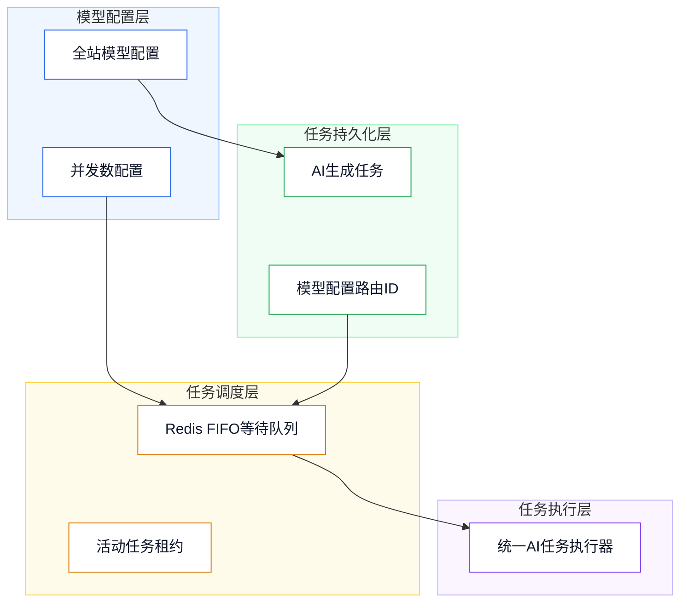

# 后端数据库说明（已实现）

## 1、设计目标

- 目标：支持图像、视频模型按全站同一模型配置同时执行请求数量，并保证超额任务顺序排队。
- 约束：并发数最小为 `1`；任务必须保留创建时使用的模型配置 ID，重启后不得改投其他模型队列。
- 目标：支持画布中多个已持久化视频按用户排序异步合成为单个 MP4 文件。
- 约束：合成任务不使用 AI 模型、不占用模型并发额度、不扣积分；单次最少 2 段、最多 20 段，源视频总时长最多 10 分钟。

## 2、总体架构

- 架构说明：`platform_ai_model_configs` 保存模型同时并发数；`ai_generation_tasks` 保存模型配置 ID；Redis 以模型配置 ID 作为队列分区键执行并发控制。



## 3、技术选型

- PostgreSQL：保存模型配置和任务恢复路由信息。
- Redis：保存按模型分区的 FIFO 等待队列和活动任务租约。
- FFmpeg / FFprobe：服务端探测视频元数据并统一转码为 H.264 视频、AAC 音频的 MP4 成片。

## 4、数据库设计

### `platform_ai_model_configs`

| 字段 | 类型 | 说明 |
| --- | --- | --- |
| `request_concurrency` | `INTEGER` | 模型同时执行请求数量，最小值为 `1`，默认值为 `1`。 |

### `ai_generation_tasks`

| 字段 | 类型 | 说明 |
| --- | --- | --- |
| `model_config_id` | `VARCHAR(64)` | 创建任务使用的全站模型配置业务 ID，用于任务恢复时进入正确的模型队列。 |

### `video_composition_tasks`

| 字段 | 类型 | 说明 |
| --- | --- | --- |
| `id` | `VARCHAR(64)` | 视频合成任务 ID，主键。 |
| `user_id` | `BIGINT` | 任务所属用户 ID，外键关联 `users.id`。 |
| `status` | `VARCHAR(20)` | 任务状态：`pending`、`running`、`succeeded`、`failed`、`canceled`。 |
| `progress` | `INTEGER` | 当前进度，取值范围为 `0` 至 `100`。 |
| `source_storage_keys` | `JSONB` | 按最终合成顺序固化的源视频媒体存储键数组。 |
| `result_data` | `JSONB` | 成片的存储键、URL、MIME、尺寸、字节数和时长。 |
| `error_message` | `TEXT` | 下载、探测、转码或上传失败时的可展示错误信息。 |
| `started_at` | `TIMESTAMPTZ` | 实际开始处理时间。 |
| `completed_at` | `TIMESTAMPTZ` | 成功、失败或取消的完成时间。 |
| `created_at` | `TIMESTAMPTZ` | 任务创建时间。 |
| `updated_at` | `TIMESTAMPTZ` | 状态或进度最后更新时间。 |

```sql
ALTER TABLE platform_ai_model_configs
    ADD COLUMN request_concurrency INTEGER NOT NULL DEFAULT 1,
    ADD CONSTRAINT ck_platform_ai_model_configs_request_concurrency CHECK (request_concurrency >= 1);

COMMENT ON COLUMN platform_ai_model_configs.request_concurrency IS '模型同时执行请求数量，最小值为1';

ALTER TABLE ai_generation_tasks
    ADD COLUMN model_config_id VARCHAR(64);

COMMENT ON COLUMN ai_generation_tasks.model_config_id IS '创建任务时使用的全站模型配置业务ID，用于模型队列恢复';

CREATE INDEX idx_ai_generation_tasks_model_config_active
    ON ai_generation_tasks(model_config_id)
    WHERE status IN ('pending', 'running');
```

```sql
CREATE TABLE video_composition_tasks (
    id VARCHAR(64) PRIMARY KEY,
    user_id BIGINT NOT NULL REFERENCES users(id),
    status VARCHAR(20) NOT NULL DEFAULT 'pending',
    progress INTEGER NOT NULL DEFAULT 0 CHECK (progress >= 0 AND progress <= 100),
    source_storage_keys JSONB NOT NULL,
    result_data JSONB NOT NULL DEFAULT '{}'::jsonb,
    error_message TEXT NOT NULL DEFAULT '',
    started_at TIMESTAMPTZ,
    completed_at TIMESTAMPTZ,
    created_at TIMESTAMPTZ NOT NULL DEFAULT CURRENT_TIMESTAMP,
    updated_at TIMESTAMPTZ NOT NULL DEFAULT CURRENT_TIMESTAMP
);

COMMENT ON TABLE video_composition_tasks IS '画布视频合成异步任务表';
COMMENT ON COLUMN video_composition_tasks.id IS '视频合成任务ID';
COMMENT ON COLUMN video_composition_tasks.user_id IS '任务所属用户ID';
COMMENT ON COLUMN video_composition_tasks.status IS '任务状态：pending等待，running执行中，succeeded成功，failed失败，canceled已取消';
COMMENT ON COLUMN video_composition_tasks.progress IS '任务进度，范围0-100';
COMMENT ON COLUMN video_composition_tasks.source_storage_keys IS '按合成顺序保存的源视频媒体存储键数组';
COMMENT ON COLUMN video_composition_tasks.result_data IS '合成结果媒体JSON数据';
COMMENT ON COLUMN video_composition_tasks.error_message IS '失败或取消原因';
COMMENT ON COLUMN video_composition_tasks.started_at IS '任务开始执行时间';
COMMENT ON COLUMN video_composition_tasks.completed_at IS '任务完成时间';
COMMENT ON COLUMN video_composition_tasks.created_at IS '任务创建时间';
COMMENT ON COLUMN video_composition_tasks.updated_at IS '任务更新时间';

CREATE INDEX idx_video_composition_tasks_user_updated
    ON video_composition_tasks(user_id, updated_at DESC);

CREATE INDEX idx_video_composition_tasks_recovery
    ON video_composition_tasks(status, created_at, id)
    WHERE status IN ('pending', 'running');
```

## 5、接口设计

- 复用既有模型配置接口：`/config/model/listModelConfigs`、`/config/model/createModelConfig`、`/config/model/updateModelConfig`。
- 模型配置响应和创建、更新请求新增 `requestConcurrency` 字段。
- `POST /api/v1/ai/video/composeVideo`：创建视频合成任务，请求体为按顺序排列的 `sourceStorageKeys`。
- `POST /api/v1/ai/video/getCompositionTask`：查询当前用户的视频合成任务状态与成片媒体。
- `POST /api/v1/ai/video/cancelCompositionTask`：取消当前用户尚未结束的视频合成任务。

## 6、测试与验收

- 并发数为 `1` 时，同一模型任务顺序执行。
- 并发数为 `3` 时，同一模型最多同时执行三个任务。
- 调高并发数后立即补位，调低时不终止已运行任务。
- 视频合成仅接受当前用户已持久化的视频媒体；重复媒体、少于 2 段、超过 20 段或总时长超过 10 分钟均会失败。
- 服务实例异常后，未完成合成任务会根据 Redis 活动任务租约重新进入 FIFO 队列；同一任务不会被重复领取。

## 7、部署说明

- 发布时由 Flyway 执行 `V10__Add_Model_Request_Concurrency.sql` 和 `V11__Add_Video_Composition_Tasks.sql`。
- Redis 必须可用；模型队列和视频合成队列均使用各自的 Redis 活动租约配置。
- 服务端镜像已安装 `ffmpeg` 与 `ffprobe`；可通过 `AI_VIDEO_COMPOSITION_FFMPEG_EXECUTABLE`、`AI_VIDEO_COMPOSITION_FFPROBE_EXECUTABLE` 覆盖二进制路径。

## 8、附录说明

- 文档状态：已实现。
