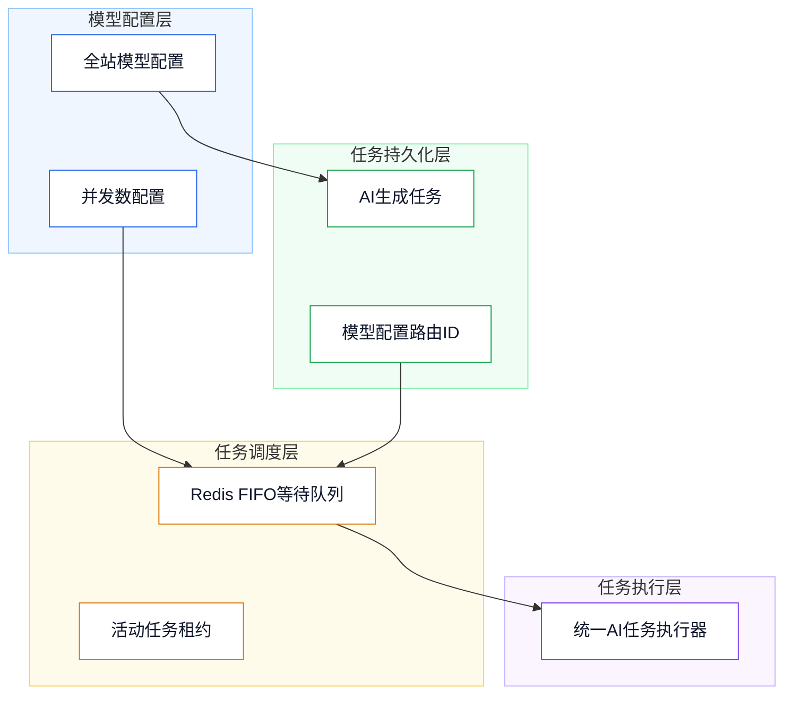

# 后端数据库说明（已实现）

## 1、设计目标

- 目标：支持图像、视频模型按全站同一模型配置同时执行请求数量，并保证超额任务顺序排队。
- 约束：并发数最小为 `1`；任务必须保留创建时使用的模型配置 ID，重启后不得改投其他模型队列。
- 目标：支持画布中多个已持久化视频按用户排序异步合成为单个 MP4 文件。
- 约束：合成任务不使用 AI 模型、不占用模型并发额度、不扣积分；单次最少 2 段、最多 20 段，源视频总时长最多 10 分钟。
- 目标：支持运营维护图片和视频生成风格的封面与分类，并向用户侧风格库提供视觉元数据。
- 约束：历史 `GenerationStyleSnapshot` 只保存生成语义字段，不保存封面和分类，保证历史任务可独立重生成。
- 目标：支持统一主 Agent 按用户和入口类型串行执行，图片、视频和画布入口互不阻塞。
- 约束：`imagePage`、`videoPage`、`canvas` 每个用户分区固定同时运行 `1` 个请求；排队记录服务重启后恢复，失去活动租约的运行记录仅中断不重放。

## 2、总体架构

- 架构说明：`platform_ai_model_configs` 保存模型同时并发数；`ai_generation_tasks` 保存模型配置 ID；Redis 以模型配置 ID 作为队列分区键执行并发控制。
- 主 Agent 调度使用 `creation_agent_request` 保存完整请求快照；Redis 以 `{user_id:entry_source}` 为 FIFO 分区键并持有单槽活动租约，SSE 事件通过按用户的 Redis Pub/Sub 通道转发。



## 3、技术选型

- PostgreSQL：保存模型配置和任务恢复路由信息。
- Redis：保存按模型分区的 FIFO 等待队列和活动任务租约。
- FFmpeg / FFprobe：服务端探测视频元数据并统一转码为 H.264 视频、AAC 音频的 MP4 成片。

## 4、数据库设计

### `platform_ai_model_configs`

| 字段 | 类型 | 说明 |
| --- | --- | --- |
| `request_concurrency` | `INTEGER` | 模型同时执行请求数量，最小值为 `1`，默认值为 `1`。 |
| `custom_body_parameters` | `JSONB` | 模型 JSON POST 请求的自定义请求体参数，顶层必须为 JSON 对象，默认 `{}`。 |

### `ai_generation_tasks`

| 字段 | 类型 | 说明 |
| --- | --- | --- |
| `model_config_id` | `VARCHAR(64)` | 创建任务使用的全站模型配置业务 ID，用于任务恢复时进入正确的模型队列。 |

### `video_composition_tasks`

| 字段 | 类型 | 说明 |
| --- | --- | --- |
| `id` | `VARCHAR(64)` | 视频合成任务 ID，主键。 |
| `user_id` | `BIGINT` | 任务所属用户 ID，外键关联 `users.id`。 |
| `status` | `VARCHAR(20)` | 任务状态：`pending`、`running`、`succeeded`、`failed`、`canceled`。 |
| `progress` | `INTEGER` | 当前进度，取值范围为 `0` 至 `100`。 |
| `source_storage_keys` | `JSONB` | 按最终合成顺序固化的源视频媒体存储键数组。 |
| `result_data` | `JSONB` | 成片的存储键、URL、MIME、尺寸、字节数和时长。 |
| `error_message` | `TEXT` | 下载、探测、转码或上传失败时的可展示错误信息。 |
| `started_at` | `TIMESTAMPTZ` | 实际开始处理时间。 |
| `completed_at` | `TIMESTAMPTZ` | 成功、失败或取消的完成时间。 |
| `created_at` | `TIMESTAMPTZ` | 任务创建时间。 |
| `updated_at` | `TIMESTAMPTZ` | 状态或进度最后更新时间。 |

### `creation_agent_request`

| 字段 | 类型 | 说明 |
| --- | --- | --- |
| `id` | `VARCHAR(64)` | 主 Agent 请求 ID，主键。 |
| `user_id` | `BIGINT` | 请求所属用户 ID，关联 `users.id`。 |
| `session_id` | `VARCHAR(64)` | 关联 Agent 会话 ID，关联 `agent_session.id`。 |
| `entry_source` | `VARCHAR(20)` | 入口来源：`imagePage`、`videoPage`、`canvas`。 |
| `request_data` | `JSONB` | 完整 `AgentChatRequest` 请求快照。 |
| `status` | `VARCHAR(20)` | `queued`、`running`、`success`、`failed`、`canceled`、`interrupted`。 |
| `plan_id` | `VARCHAR(64)` | 主 Agent 创建后的创作计划 ID，可为空。 |
| `task_ids` | `JSONB` | 已创建底层 AI 任务 ID 数组，用于精确取消和重启中断。 |
| `error_message` | `TEXT` | 失败、取消或中断的用户可见说明。 |
| `started_at` | `TIMESTAMPTZ` | 调度器领取后的开始时间。 |
| `completed_at` | `TIMESTAMPTZ` | 进入终态的完成时间。 |
| `created_at` | `TIMESTAMPTZ` | 请求创建时间。 |
| `updated_at` | `TIMESTAMPTZ` | 记录最后更新时间。 |

### `generation_styles`

| 字段 | 类型 | 说明 |
| --- | --- | --- |
| `cover_url` | `TEXT` | 风格封面的公开访问地址；旧记录默认空字符串，用户侧使用中性默认封面展示。 |
| `category` | `VARCHAR(100)` | 运营维护的风格分类；旧记录默认空字符串，用户侧不生成分类筛选标签。 |

```sql
ALTER TABLE platform_ai_model_configs
    ADD COLUMN request_concurrency INTEGER NOT NULL DEFAULT 1,
    ADD CONSTRAINT ck_platform_ai_model_configs_request_concurrency CHECK (request_concurrency >= 1);

COMMENT ON COLUMN platform_ai_model_configs.request_concurrency IS '模型同时执行请求数量，最小值为1';

ALTER TABLE ai_generation_tasks
    ADD COLUMN model_config_id VARCHAR(64);

COMMENT ON COLUMN ai_generation_tasks.model_config_id IS '创建任务时使用的全站模型配置业务ID，用于模型队列恢复';

CREATE INDEX idx_ai_generation_tasks_model_config_active
    ON ai_generation_tasks(model_config_id)
    WHERE status IN ('pending', 'running');
```

```sql
CREATE TABLE video_composition_tasks (
    id VARCHAR(64) PRIMARY KEY,
    user_id BIGINT NOT NULL REFERENCES users(id),
    status VARCHAR(20) NOT NULL DEFAULT 'pending',
    progress INTEGER NOT NULL DEFAULT 0 CHECK (progress >= 0 AND progress <= 100),
    source_storage_keys JSONB NOT NULL,
    result_data JSONB NOT NULL DEFAULT '{}'::jsonb,
    error_message TEXT NOT NULL DEFAULT '',
    started_at TIMESTAMPTZ,
    completed_at TIMESTAMPTZ,
    created_at TIMESTAMPTZ NOT NULL DEFAULT CURRENT_TIMESTAMP,
    updated_at TIMESTAMPTZ NOT NULL DEFAULT CURRENT_TIMESTAMP
);

COMMENT ON TABLE video_composition_tasks IS '画布视频合成异步任务表';
COMMENT ON COLUMN video_composition_tasks.id IS '视频合成任务ID';
COMMENT ON COLUMN video_composition_tasks.user_id IS '任务所属用户ID';
COMMENT ON COLUMN video_composition_tasks.status IS '任务状态：pending等待，running执行中，succeeded成功，failed失败，canceled已取消';
COMMENT ON COLUMN video_composition_tasks.progress IS '任务进度，范围0-100';
COMMENT ON COLUMN video_composition_tasks.source_storage_keys IS '按合成顺序保存的源视频媒体存储键数组';
COMMENT ON COLUMN video_composition_tasks.result_data IS '合成结果媒体JSON数据';
COMMENT ON COLUMN video_composition_tasks.error_message IS '失败或取消原因';
COMMENT ON COLUMN video_composition_tasks.started_at IS '任务开始执行时间';
COMMENT ON COLUMN video_composition_tasks.completed_at IS '任务完成时间';
COMMENT ON COLUMN video_composition_tasks.created_at IS '任务创建时间';
COMMENT ON COLUMN video_composition_tasks.updated_at IS '任务更新时间';

CREATE INDEX idx_video_composition_tasks_user_updated
    ON video_composition_tasks(user_id, updated_at DESC);

CREATE INDEX idx_video_composition_tasks_recovery
    ON video_composition_tasks(status, created_at, id)
    WHERE status IN ('pending', 'running');
```

```sql
ALTER TABLE generation_styles
    ADD COLUMN cover_url TEXT NOT NULL DEFAULT '',
    ADD COLUMN category VARCHAR(100) NOT NULL DEFAULT '';

COMMENT ON COLUMN generation_styles.cover_url IS '风格封面公开访问地址';
COMMENT ON COLUMN generation_styles.category IS '风格分类';
```

```sql
CREATE TABLE creation_agent_request (
    id VARCHAR(64) PRIMARY KEY,
    user_id BIGINT NOT NULL REFERENCES users(id),
    session_id VARCHAR(64) NOT NULL REFERENCES agent_session(id) ON DELETE CASCADE,
    entry_source VARCHAR(20) NOT NULL,
    request_data JSONB NOT NULL,
    status VARCHAR(20) NOT NULL DEFAULT 'queued',
    plan_id VARCHAR(64) REFERENCES agent_plan(id) ON DELETE SET NULL,
    task_ids JSONB NOT NULL DEFAULT '[]'::jsonb,
    error_message TEXT NOT NULL DEFAULT '',
    started_at TIMESTAMPTZ,
    completed_at TIMESTAMPTZ,
    created_at TIMESTAMPTZ NOT NULL DEFAULT CURRENT_TIMESTAMP,
    updated_at TIMESTAMPTZ NOT NULL DEFAULT CURRENT_TIMESTAMP,
    CONSTRAINT ck_creation_agent_request_entry_source CHECK (entry_source IN ('imagePage', 'videoPage', 'canvas')),
    CONSTRAINT ck_creation_agent_request_status CHECK (status IN ('queued', 'running', 'success', 'failed', 'canceled', 'interrupted'))
);

COMMENT ON TABLE creation_agent_request IS '统一主Agent请求队列持久化记录表';
COMMENT ON COLUMN creation_agent_request.id IS '主Agent请求ID';
COMMENT ON COLUMN creation_agent_request.user_id IS '请求所属用户ID';
COMMENT ON COLUMN creation_agent_request.session_id IS '关联Agent会话ID';
COMMENT ON COLUMN creation_agent_request.entry_source IS '入口来源：imagePage、videoPage、canvas';
COMMENT ON COLUMN creation_agent_request.request_data IS '完整AgentChatRequest请求快照JSON';
COMMENT ON COLUMN creation_agent_request.status IS '请求状态：queued排队、running运行、success成功、failed失败、canceled取消、interrupted重启中断';
COMMENT ON COLUMN creation_agent_request.plan_id IS '主Agent创建后的创作计划ID';
COMMENT ON COLUMN creation_agent_request.task_ids IS '已创建底层AI任务ID数组';
COMMENT ON COLUMN creation_agent_request.error_message IS '失败、取消或中断原因';
COMMENT ON COLUMN creation_agent_request.started_at IS '请求被领取并开始执行的时间';
COMMENT ON COLUMN creation_agent_request.completed_at IS '请求进入终态的时间';
COMMENT ON COLUMN creation_agent_request.created_at IS '请求创建时间';
COMMENT ON COLUMN creation_agent_request.updated_at IS '请求最后更新时间';

CREATE INDEX idx_creation_agent_request_recovery
    ON creation_agent_request(status, created_at ASC, id ASC)
    WHERE status IN ('queued', 'running');

CREATE INDEX idx_creation_agent_request_user_entry_created
    ON creation_agent_request(user_id, entry_source, created_at ASC, id ASC);

CREATE INDEX idx_creation_agent_request_session_created
    ON creation_agent_request(session_id, created_at DESC);
```

## 5、接口设计

- 复用既有模型配置接口：`/config/model/listModelConfigs`、`/config/model/createModelConfig`、`/config/model/updateModelConfig`。
- 模型配置响应和创建、更新请求新增 `requestConcurrency` 字段。
- `POST /api/v1/ai/video/composeVideo`：创建视频合成任务，请求体为按顺序排列的 `sourceStorageKeys`。
- `POST /api/v1/ai/video/getCompositionTask`：查询当前用户的视频合成任务状态与成片媒体。
- `POST /api/v1/ai/video/cancelCompositionTask`：取消当前用户尚未结束的视频合成任务。
- `POST /api/v1/ai/agent/chat`：返回本次 `sessionId`、`requestId` 和 `queued` 或 `running` 状态。
- `POST /api/v1/ai/agent/cancelChat`：按 `requestId` 精确取消排队或运行中的统一主 Agent 请求。
- `GET /api/v1/style/listStyles`：返回当前类型的启用风格，包含 `coverUrl`、`category`，不改变风格 ID 和历史快照语义。
- `GET /api/v1/admin/style/listStyles`、`POST /api/v1/admin/style/createStyle`、`POST /api/v1/admin/style/updateStyle`：管理端维护风格封面与分类；创建和更新请求均要求非空 `coverUrl`、`category`。

## 6、测试与验收

- 并发数为 `1` 时，同一模型任务顺序执行。
- 并发数为 `3` 时，同一模型最多同时执行三个任务。
- 调高并发数后立即补位，调低时不终止已运行任务。
- 视频合成仅接受当前用户已持久化的视频媒体；重复媒体、少于 2 段、超过 20 段或总时长超过 10 分钟均会失败。
- 服务实例异常后，未完成合成任务会根据 Redis 活动任务租约重新进入 FIFO 队列；同一任务不会被重复领取。
- 管理端创建、更新风格时，封面与分类均会持久化并返回到用户侧风格列表。
- 历史空封面、空分类记录仍可显示并用于历史重生成；普通生成最多选择 1 个风格，历史重生成最多保留 3 个风格快照。
- 同一用户的图片请求按提交顺序串行，视频和画布请求可并行；不同用户的相同入口请求互不阻塞。
- 取消排队请求不会影响运行请求和其他入口分区；取消运行请求会继续取消关联计划及已创建的底层任务。
- 服务重启后 `queued` 请求按创建顺序恢复；没有有效活动租约的 `running` 请求标记为 `interrupted`，不会重复执行或重复写画布。

## 7、部署说明

- 发布时由 Flyway 执行至 `V13__Add_Creation_Agent_Requests.sql`。
- Redis 必须可用；模型队列、视频合成队列和统一主 Agent 队列均使用各自的 Redis 活动租约配置。
- 服务端镜像已安装 `ffmpeg` 与 `ffprobe`；可通过 `AI_VIDEO_COMPOSITION_FFMPEG_EXECUTABLE`、`AI_VIDEO_COMPOSITION_FFPROBE_EXECUTABLE` 覆盖二进制路径。

## 8、附录说明

- 文档状态：已实现。
